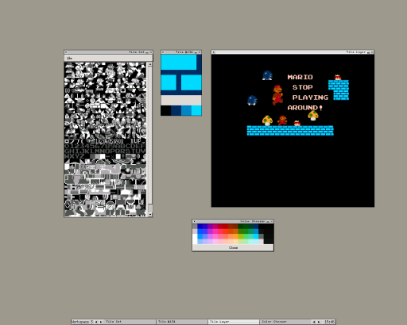

Nestile - A tile editor for creating / editing NES graphics

1. Introduction and System Requirements
2. Using Nestile
3. Saving and Loading Tiles
4. Configuration Menu
5. Placeholders / Bugs
6. Contact / Credit

1. Introduction and System Requirements

Nestile is a tile editor created solely for editing graphics for NES programs.
Better tile editors exist, but to my knowledge, none which are useable in
Linux, which is the target platform of this program (although it should work
in any OS which meets the requirements). It is useable both to create new
files containing raw NES graphics data, or to directly edit files containing
either raw NES graphics data or iNES formatted ROMs that store graphics in
CHR-ROM.

To use the program, you will need to have Python (version >= 2.3) installed on
your machine as well as PyGTK (version >= 2.0). For reference, my machine is
a Debian system with Python version 2.3.5 and PyGTK 2.0. Actually, the
requirements I gave are guesses, since I don't have any other versions to
test, so you're welcome to try running it on earlier versions. If you do
and it works, let me know.

Also, I'm not totally sure, but you might run into trouble running the program
if you're using a color resolution other than 16-bit. I get the impression from
some of the hackish, ugly things I did
in the code, there may be a problem with that.

This is alpha software, very much so. It does what I need,
though, so it might do what you need, too.

2. Using Nestile

Using Nestile is somewhat straight forward. Just run the file "nestile" and
the GUI will pop up. The long, skinny window with the File menu on it is the
Tile Set window, the smallest window with the colors on the bottom is the Tile
Editor window, and the other window is the Tile Layer window. When starting
the program, all the windows should be blank.

The Tile Set window displays all the tiles in your ROM in monochrome, with
black representing color 0, the brightest white representing color 3, and
color 1 and 2 represented by the second darkest and second brightest shades
of gray, respectively. By clicking on a tile in the Tile Set window, you
choose which tile you want to edit in the Tile Editor window or paste onto the
Tile Layer window. (Note: when I say color 0, 1, 2, 3, I mean that the pixels in
the CHR-ROM file will be represented with the 2-bit value 0, 1, 2, or 3.
Refer to information on the NES graphics format for more details).

The Tile Editor window is where you actually make changes to a tile. Click the
colors to choose which color to draw with. The leftmost color represents color
0, the one to the right of it color 1, to the right of that color 2, and the
rightmost represents color 3. Edit the tile by clicking the mouse on the Tile
Edit screen. Edits you make here will show up in the Tile Set window as well
as wherever you have the tile pasted in the Tile Layer window. You can change
the color palette you are using by double clicking any of the colors to pull
up the palette window. By clicking one of those colors, you assign that value
to the currently selected color slot. This has no effect on how the data will
be stored, so it's mostly for you to get an idea of what the graphics might
look like (and you'll probably want to change it, since the default palette I
apparently selected while I was drunk). The available palette is taken from
freely available NES palettes (I forget whose, maybe Loopy's). One warning about
changing palettes - the code for updating the color information is very, very
hackish. Choosing a color which is extremely close in value to another color
already selected in your palette may cause the tile to change any pixels in that
already selected color to the newly selected color. I kind of doubt this is a
practical problem, though, as I think the colors would have to be nearly
indistinguishable, anyway. This is unlikely to be fixed unless someone emails
me with a better way to update colors when the palettes are changed. Also, there
is a bug where drawing while moving the mouse past the edge of the window will
draw over onto the next tile over.

The Tile Layer window is where you can paste the tiles, to arrange them and
get an idea of how they look when assembled. Clicking on the window will paste
the currently selected tile to the Tile Layer window, in the 16x16 grid that you
clicked on. The current palette is saved, so any changes to the palette in the
Tile Layer window do not affect tiles which you have already pasted. This allows
you to look at the same tile with different palettes and get an idea of which
one will work best for you.

3. Saving and Loading Tiles

Files can be loaded in two different ways. The first way is to open a raw
CHR-ROM file, in the same format saved as above. Again, this will only load the
first 8192 bytes for now. The second way is to load an iNES format ROM image
that has CHR-ROM data (about 3/4 of known NES roms do). Again, this is limited,
as it will only load the first 8192 bytes of CHR-ROM. I may get around to
bumping that up, though. In the meantime, if you want to look at the other data
in an iNES ROM, either change the code in nestile (it actually wouldn't be too
hard to do) or use a tool like "dd" to extract the raw data from the ROM (which
is what I would do, because I am lazy)

Files can also be saved in one of two different ways, depending on how they
were loaded. If no file was loaded, or a raw CHR file was loaded, the file
will be saved as a raw CHR file. If the file was loaded from an iNES formatted
file, then it will be saved as one. This means that you can use the program
to edit the graphics in ROMs that have a CHR-ROM.

Something to note - the palette information is not saved in any form or
fashion. That is there as an aid for you, but you'll be responsible for keeping
up with the palette in your own programs.

4. Configuration Menu

The configuration menu is found under the "Edit" option of the menubar on the
Tile Set window. This option lets you change the size of the CHR-ROM that you
are currently working on. For the moment, this only works for raw CHR-ROM
graphics - that is, if you open a iNES format ROM file, you can't change the
size (although you can view it). This might change in the future. The size
specified will be rounded up to the nearest multiple of 8192 bytes.

5. Placeholders / Bugs

Many of these are mentioned above, but I'll try to collect them all here for
reference.

- [x] Drawing past the edge of the window on the Tile Edit window will draw on the
  adjacent tile

- [x] Changing a color in the palette to something very close to the a color already
  in the palette will change any pixels drawn in that color to the newly
  selected color, as well (this might not be a huge problem, unless you're doing
  something weird).

- [x] You might have problems with the program if you run a color resolution other
  than 16-bit (maybe not, though - haven't tested it).

- [x] Fix that you can't change two colors in the palette to the same color. This is to
  prevent the aforementioned bug where you could accidentally overwrite a color
  by selecting one similar to it.

- [ ] The program seems to crash on my system when loading very large files. This
  might be system dependent, not really sure. Probably due to the unintelligent
  way I go about loading files, and doesn't affect my needs, so this probably
  will not get fixed.

- [ ] There are probably plenty of other bugs. Let me know about them and I may end
  up trying to fix them, if you really want to use the program.

- [x] Add support for for left click and right click colors

- [x] Add selection indicators for currently selected tiles and colors

- [x] Split the view into a class separate from the tile data model

- [ ] Update README with new requirements and new screen shot

- [x] Add scroll wheel support

- [x] Make palette window modal or tied to which color is right clicked

- [ ] Add Tile Layout saving

- [ ] Add Tile Layout batch processing

- [ ] Add Tile Layout options to more accurately reflect PPU palettes

- [x] Fix `chr_rom_size` logic

- [x] Make `nes_palette` strings

- [x] Add save/saveAs filename support

- [x] Add support for specifying a file to open on the cmdline

6. Contact / Credit

This webpage for this program is http://ensomnya.net/projects/nestile/index.html
Any updates made should be posted there.

Thanks to all the folks who worked on reverse-engineering the NES and creating
freely available documentation for it. Thanks also to John Finlay for his
PyGTK documents, which made it pretty easy to pick this library up and do
something with it.

Author : J. A. McMahan Jr.
Version: See changes.txt for details on changes in different versions
License: See license.txt for details, but it's a modified BSD license. By
         using this software, you agree to abide by the license.

